# Warning: Website under construction

This is an analysis of a diabetes dataset, which I did after completing the courses on [Kaggle][kaggle]. Afterwards, I chose a dataset from [Kaggle datasets][kaggle-datasets], and performed a basic analysis using pandas to ... and scikit-learn to ...

This project was developed using Jupyter Notebooks. In this blog post I'll try to explain my thought process through every step of the project.
[Here][diabetes-data-analysis-github] you can find the original file.

# Project Overview

The dataset contains data collected by the Iraqi society, acquired from the laboratory of Medical City Hospital and the Specialized Center for Endocrinology and Diabetes-Al-Kindy Teaching Hospital. As said before, this dataset was sourced from [Kaggle][kaggle].

The columns in the dataset are:

* **ID**. Unique patient ID.
* **Gender**. Biological sex of the patient. Usually encoded as: 0 = Female, 1 = Male.
* **AGE**. Age of patient in years.
* **Urea**. Measures the level of urea in the blood (mg/dL). High levels may indicate kidney issues, common complications of diabetics. Normal range: 7-20 mg/dL.
* **Cr** (Creatinine). Measures the level of creatine in the blood (mg/dL). High levels may indicate kidney issues, common complications of diabetics. Normal range: 0.6-1.3 mg/dL.
* **HbA1c** (Glycated Hemoglobin). Indicator of average blood glucose levels over the past 2-3 months. Normal: 5.7%. Prediabetic: 5.7-6.4%. Diabetic: 6.5%.
* **Chol** (Cholesterol). Measures the level of cholesterol in the blood (mg/dL). High levels are a risk factor for cardiovascular disease, common complications of diabetics. Normal range: 200 mg/dL.
* **TG** (Triglycerides). Measures the level of fat in the blood (mg/dL). High levels is associated with insulin resistance and metabolic syndrome. Normal range: 150 mg/dL.
* **HDL** (High-Density Lipoprotein). Measures the level of "good" cholesterol (mg/dL). Helps remove excess cholesterol from the bloodstream. Ideal: 40 mg/dL (men), 50 mg/dL (women).
* **LDL** (Low-Density Lipoprotein). Measures the level of "bad" cholesterol (mg/dL). Contributes to plaque buildup in the arteries. Ideal: 100 mg/dL.
* **VLDL** (Very Low-Density Lipoprotein). Measures the level of another "bad" cholesterol (mg/dL), carries triglycerides. Often estimated from TG/5. High levels are associated with increased diabetes risk. Normal: 2-30 mg/dL.
* **BMI** (Body Mass Index). Measure of body fat based on height and weight (kg/m 
). Obesity is a risk factor for Type 2 diabetes. Underweight: 18.5, Normal: 18.5-24.9, Overweight: 25-29.9, Obese: 30.
* **CLASS**. Indicates whether the patient is Non-Diabetic ('N'), is Diabetic ('Y') or is Predict-Diabetic ('P').

**Source:** Rashid, Ahlam (2020), “Diabetes Dataset”, Mendeley Data, V1, doi: 10.17632/wj9rwkp9c2.1

I started by importing the necessary libraries.



import pandas as pd
from sklearn.preprocessing import OrdinalEncoder
import seaborn as sns
import matplotlib.pyplot as plt
import numpy as np



After that, I loaded the dataset using pandas.



def load_data(path='Multiclass Diabetes Dataset - Original.csv'):
    df = pd.read_csv(path)

    df.drop(columns=['No_Pation'], inplace=True)
    
    return df





df = load_data()

print(df)
print(df.columns)



This is the resulting dataset:



            ID Gender  AGE  Urea  Cr  HbA1c  Chol   TG  HDL  LDL  VLDL   BMI CLASS
      0    502      F   50   4.7  46    4.9   4.2  0.9  2.4  1.4   0.5  24.0     N
      1    735      M   26   4.5  62    4.9   3.7  1.4  1.1  2.1   0.6  23.0     N
      2    420      F   50   4.7  46    4.9   4.2  0.9  2.4  1.4   0.5  24.0     N
      3    680      F   50   4.7  46    4.9   4.2  0.9  2.4  1.4   0.5  24.0     N
      4    504      M   33   7.1  46    4.9   4.9  1.0  0.8  2.0   0.4  21.0     N
      ..   ...    ...  ...   ...  ..    ...   ...  ...  ...  ...   ...   ...   ...
      995  200      M   71  11.0  97    7.0   7.5  1.7  1.2  1.8   0.6  30.0     Y
      996  671      M   31   3.0  60   12.3   4.1  2.2  0.7  2.4  15.4  37.2     Y
      997  669      M   30   7.1  81    6.7   4.1  1.1  1.2  2.4   8.1  27.4     Y
      998   99      M   38   5.8  59    6.7   5.3  2.0  1.6  2.9  14.0  40.5     Y
      999  248      M   54   5.0  67    6.9   3.8  1.7  1.1  3.0   0.7  33.0     Y

      [1000 rows x 13 columns]
      Index(['ID', 'Gender', 'AGE', 'Urea', 'Cr', 'HbA1c', 'Chol', 'TG', 'HDL',
            'LDL', 'VLDL', 'BMI', 'CLASS'],
            dtype='object')



# Project Questions and Objectives

I choose two objectives, ones that allowed me to work with both data analysis and machine learning.

The first part was about data analysis. Considering age, gender, BMI, blood sugar level and cholesterol, which of these factors are risk factors for Type 2 diabetes?

The second used machine learning: develop a machine learning model that can predict diabetes status (Diabetic, Non-Diabetic or Predict-Diabetic).

# Data Cleaning and Pre-Processing

The first step was making the data easier to work with.

I did it by removing duplicates and null values. There were no null values, as you can see with this function.



def clean_data(df):
    print(df.isna().any())
    df.dropna(inplace=True)

    df.drop_duplicates(['Gender', 'AGE', 'Urea', 'Cr', 'HbA1c', 'Chol', 'TG', 'HDL', 'LDL', 'VLDL', 'BMI', 'CLASS'], inplace=True)

    df.reset_index(drop=True, inplace=True)

clean_data(df)





ID        False
Gender    False
AGE       False
Urea      False
Cr        False
HbA1c     False
Chol      False
TG        False
HDL       False
LDL       False
VLDL      False
BMI       False
CLASS     False
dtype: bool



Furthermore, to render the data easier to analyze, I decide to encode the 'Gender' and 'CLASS' after checking how many values appear in them.



def data_exploration(df):
    # find problems in categorical rows
    print(df['Gender'].unique()) 
    print(df['CLASS'].unique())
    
    # find how big are problems in categorical rows
    print(df['Gender'].value_counts())
    print(df['CLASS'].value_counts())

data_exploration(df)





['F' 'M' 'f']
['N' 'N ' 'P' 'Y' 'Y ']
Gender
M    467
F    363
f      1
Name: count, dtype: int64
CLASS
Y     691
N      95
P      40
Y       4
N       1
Name: count, dtype: int64



Since the unexpected values are relatively few, I simply dropped those from the database.

I decided to encode the columns with F = 0 and M = 1 for 'Gender', and with N = 0, P = 1, Y = 2 for 'CLASS'.



def pre_process_data(df):
    # drop 'N ' and 'Y ' values from 'CLASS', and 'f' values from 'Gender' (they are a small enough number)
    df.drop(df[(df['CLASS']=='Y ') | (df['CLASS']=='N ') | (df['Gender']=='f')].index, inplace=True)
    
    # encode 'Gender' and 'CLASS' columns: [F=0, M=1] and ['N'=0, 'P'=1, 'Y'=2]
    enc = OrdinalEncoder()
    df[['Gender', 'CLASS']] = enc.fit_transform(df[['Gender', 'CLASS']])
    
    return df

pre_process_data(df)





	ID	Gender	AGE	Urea	Cr	HbA1c	Chol	TG	HDL	LDL	VLDL	BMI	CLASS
0	502	0.0	50	4.7	46	4.9	4.2	0.9	2.4	1.4	0.5	24.0	0.0
1	735	1.0	26	4.5	62	4.9	3.7	1.4	1.1	2.1	0.6	23.0	0.0
2	504	1.0	33	7.1	46	4.9	4.9	1.0	0.8	2.0	0.4	21.0	0.0
3	634	0.0	45	2.3	24	4.0	2.9	1.0	1.0	1.5	0.4	21.0	0.0
4	721	0.0	50	2.0	50	4.0	3.6	1.3	0.9	2.1	0.6	24.0	0.0
...	...	...	...	...	...	...	...	...	...	...	...	...	...
821	194	0.0	57	4.1	70	9.3	5.3	3.3	1.0	1.4	1.3	29.0	2.0
823	196	1.0	55	3.1	39	8.5	5.0	2.5	1.9	2.9	0.7	27.0	2.0
824	198	1.0	28	3.5	61	8.5	4.5	1.9	1.1	2.6	0.8	37.0	2.0
825	199	1.0	69	10.3	185	7.7	4.9	1.9	1.2	3.0	0.7	37.0	2.0
826	200	1.0	71	11.0	97	7.0	7.5	1.7	1.2	1.8	0.6	30.0	2.0
825 rows x 13 columns



# Exploratory Data Analysis (EDA)

I wrote a section to visualize the distribution of the factors I was considering (age, gender, BMI, blood sugar level and cholesterol), both on the whole population and by class. I chose histograms to visualize the distribution, and boxplots to see whether the distribution is simmetrical or skewed.

## Gender Distribution



def plot_gender(df):
    # visualize the correlation between gender and class
    df_reduced = df[['Gender', 'CLASS']]

    # plot the gender distribution
    
    df1 = df_reduced.groupby(['Gender']).size().reset_index(name='number_patients')

    plt.figure(figsize=(5, 5))
    ax = sns.barplot(x='Gender', y='number_patients', hue='Gender', data=df1)
    plt.ylabel("Number of Patients")

    legend = ax.get_legend()
    handles = legend.legend_handles
    ax.legend(handles, ["Female","Male"], title='Gender')

    ax.set_xticks(range(2))
    ax.set_xticklabels(['Female', 'Male'])
    
    # plot the gender distribution by class

    df2 = df_reduced.groupby(['Gender', 'CLASS']).size().reset_index(name='number_patients')

    plt.figure(figsize=(5, 5))
    ax = sns.barplot(x='CLASS', y='number_patients', hue='Gender', data=df2)
    plt.ylabel("Number of Patients")
    
    legend = ax.get_legend()
    handles = legend.legend_handles
    ax.legend(handles, ["Female","Male"], title='Gender')

    ax.set_xticks(range(3))
    ax.set_xticklabels(['non-diabetic', 'predict-diabetic', 'diabetic'])

plot_gender(df)



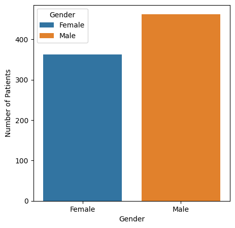
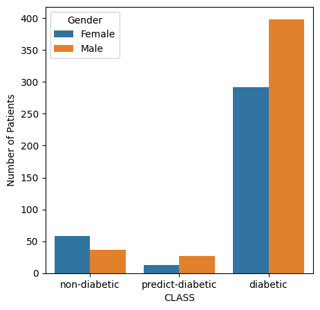

## Age Distribution



    # visualize the correlation between age and class
    # plot the Age distribution with histogram

    plt.figure(figsize=(5,5))
    ax = plt.hist(df['AGE'], [20, 25, 30, 35, 40, 45, 50, 55, 60, 65, 70, 80])
    plt.xlabel("Age")
    plt.ylabel("Number of Patients")
    #plt.title = ('Age Distrubtion')

    # plot the Age distribution with boxplot

    plt.figure(figsize=(5,5))
    ax = sns.boxplot(x=df['AGE'], flierprops={"marker": "d"})
    plt.xlabel("Age")

    # plot the Age distribution by class

    diabetic = df[df['CLASS']==0]
    predict_diabetic = df[df['CLASS']==1]
    non_diabetic = df[df['CLASS']==2]

    plt.figure(figsize=(5,5))
    ax = plt.hist([diabetic['AGE'], predict_diabetic['AGE'], non_diabetic['AGE']], [20, 25, 30, 35, 40, 45, 50, 55, 60, 65, 70, 75, 80])
    plt.xlabel("Age")
    plt.ylabel("Number of Patients")
    plt.legend([0,1,2])

plot_age(df)



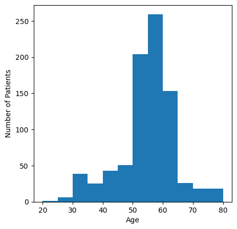
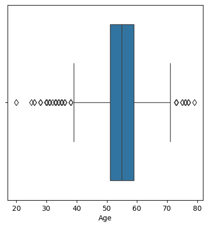
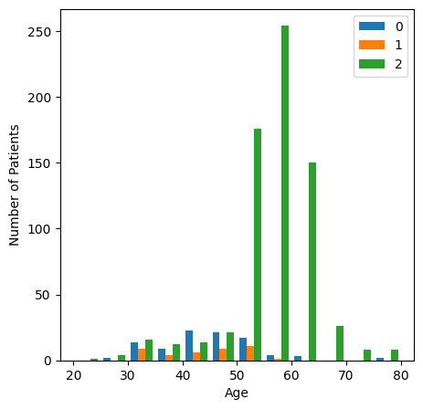

## BMI Distribution



def plot_BMI(df):
     
    # visualize the correlation between BMI and class
    # plot the BMI distribution with histogram

    plt.figure(figsize=(5,5))
    ax = plt.hist(df['BMI'], [15, 20, 25, 30, 35, 40, 45, 50])
    plt.xlabel("BMI")
    plt.ylabel("Number of Patients")

    # plot the BMI distribution with boxplot

    plt.figure(figsize=(5,5))
    ax = sns.boxplot(x=df['BMI'], flierprops={"marker": "d"})
    plt.xlabel("BMI")

    # plot the BMI distribution by class

    diabetic = df[df['CLASS']==0]
    predict_diabetic = df[df['CLASS']==1]
    non_diabetic = df[df['CLASS']==2]

    plt.figure(figsize=(5,5))
    ax = plt.hist([diabetic['BMI'], predict_diabetic['BMI'], non_diabetic['BMI']], [15, 20, 25, 30, 35, 40, 45, 50])
    plt.xlabel("BMI")
    plt.ylabel("Number of Patients")
    plt.legend([0,1,2])

plot_BMI(df)



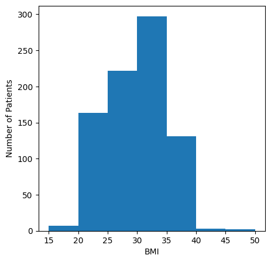
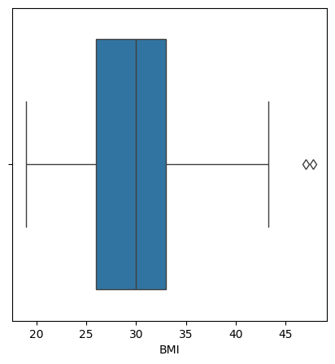
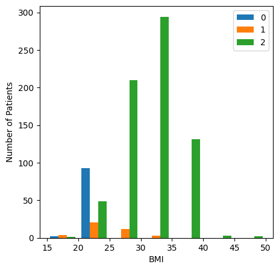

## HbA1c Distribution



def plot_HbA1c(df):
     
    # visualize the correlation between HbA1c and class
    # plot the HbA1c distribution with histogram

    plt.figure(figsize=(5,5))
    ax = plt.hist(df['HbA1c'], [0,1,2,3,4,5,6,7,8,9,10,11,12,13,14,15,16])
    plt.xlabel("HbA1c")
    plt.ylabel("Number of Patients")

    # plot the HbA1c distribution with boxplot

    plt.figure(figsize=(5,5))
    ax = sns.boxplot(x=df['HbA1c'], flierprops={"marker": "d"})
    plt.xlabel("HbA1c")

    # plot the HbA1c distribution by class

    diabetic = df[df['CLASS']==0]
    predict_diabetic = df[df['CLASS']==1]
    non_diabetic = df[df['CLASS']==2]

    plt.figure(figsize=(5,5))
    ax = plt.hist([diabetic['HbA1c'], predict_diabetic['HbA1c'], non_diabetic['HbA1c']], [0,1,2,3,4,5,6,7,8,9,10,11,12,13,14,15,16])
    plt.xlabel("HbA1c")
    plt.ylabel("Number of Patients")
    plt.legend([0,1,2])

plot_HbA1c(df)



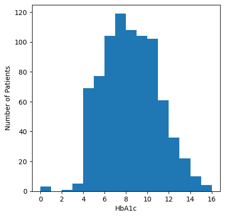
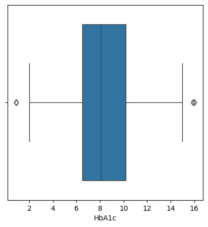
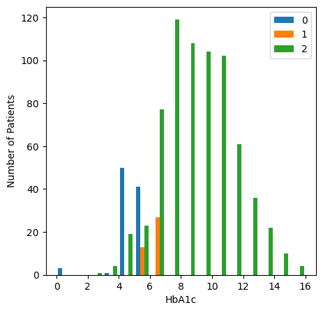

## Cholesterol Distribution



def plot_Chol(df):
     
    # visualize the correlation between Chol and class
    # plot the Chol distribution with histogram

    plt.figure(figsize=(5,5))
    ax = plt.hist(df['Chol'], [0,1,2,3,4,5,6,7,8,9,10])
    plt.xlabel("Chol")
    plt.ylabel("Number of Patients")

    # plot the Chol distribution with boxplot

    plt.figure(figsize=(5,5))
    ax = sns.boxplot(x=df['Chol'], flierprops={"marker": "d"})
    plt.xlabel("Chol")

    # plot the Chol distribution by class

    diabetic = df[df['CLASS']==0]
    predict_diabetic = df[df['CLASS']==1]
    non_diabetic = df[df['CLASS']==2]

    plt.figure(figsize=(5,5))
    ax = plt.hist([diabetic['Chol'], predict_diabetic['Chol'], non_diabetic['Chol']], [0,1,2,3,4,5,6,7,8,9,10])
    plt.xlabel("Chol")
    plt.ylabel("Number of Patients")
    plt.legend([0,1,2])

plot_Chol(df)



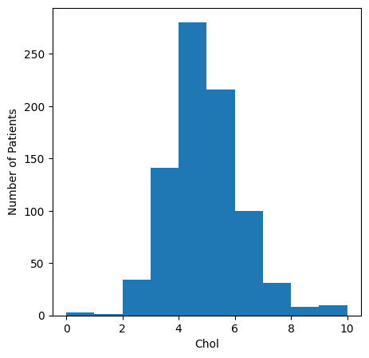
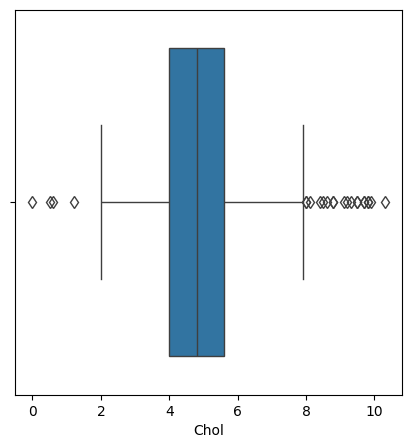
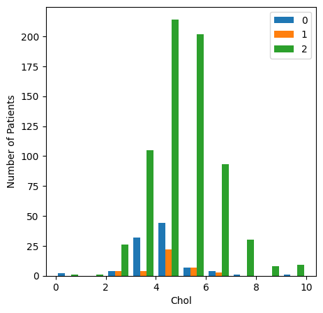

# Hypotesis Testing





[kaggle]: https://www.kaggle.com/
[kaggle-datasets]: https://www.kaggle.com/datasets
[diabetes-data-analysis-github]: https://github.com/martabalbo/diabetes-data-analysis
